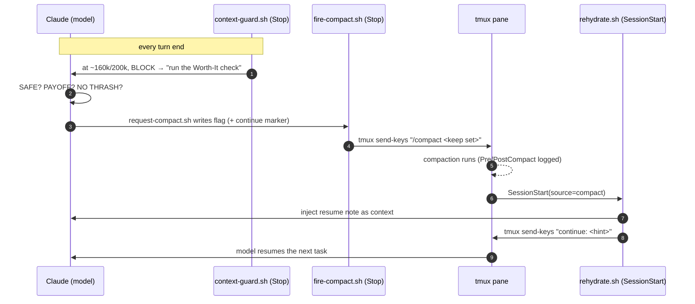

# claude-tmux-compact

**Stop babysitting `/compact`. Let Claude Code compact itself — and keep working.**


[Claude Code](https://claude.com/claude-code) fills its context window as a
session runs long, and once it's near full, answers start to drift. The usual fix
is to run `/compact` yourself — but that means watching the meter, guessing what's
safe to drop, and re-explaining where you were every single time.

**claude-tmux-compact makes Claude decide *when* to compact, keep only what's
needed to continue, then resume the next task by itself — with zero keystrokes.**

It's built for long, autonomous runs: a ~100k-line codebase, agents working for
days, you checking in occasionally instead of nursing the context meter.

> Not affiliated with Anthropic. It drives the public Claude Code hooks API plus
> tmux. The "model presses its own button" trick needs tmux because a model
> cannot run a slash command on itself.

---

## The idea in one breath

> Wrap Claude Code in **tmux** and capture the **pane id** at startup. When the
> model decides it's time, it writes a **pre-compact note** (what to keep). A
> **Stop hook** types `/compact <keep…>` into that pane for it. After compaction,
> a **SessionStart hook** types `continue` — and your work just keeps running.

That's the whole trick. Everything else is making it safe, automatic, and tunable.

---

## Why this matters on long runs

Real-world setup this was built for: a main codebase around **100k lines**, agents
running **for a week at a time**. The point isn't a bigger window — it's a
*cleaner* one.

- **Working context never crosses ~200k.** The guard holds the line well below
  that, so quality stays high the whole run.
- **So it isn't Opus-specific.** You don't need a 1M-token model. Any model that
  comfortably handles ~200k of context benefits the same way — this is a workflow
  pattern, not a model feature.
- **It runs unattended.** Compact-and-resume happens between turns; you don't have
  to be at the keyboard for the session to keep moving.

---

## Why compact at all?

Compaction shrinks the memory context handed to the model each turn. That history
grows fast and most of it stops being useful:

- the model reads lots of **related files** while exploring,
- there's **back-and-forth chat** that never reached a conclusion,
- old tool output and dead ends pile up.

Even top-tier models (Opus included) start to **drift as context approaches the
limit**. Claude Code has a built-in auto-compact when memory is full — but by then
you're already in the degraded zone, and **the harness isn't smart enough to know
what's worth keeping**. On a 1M-context model your tokens can pour out at 700–800k
with caching, while the data the model *actually needs* might be ~100k after a
clean compaction.

So the real questions are *when* to compact and *what* to keep — and those need
**rules you give the model**, not guesswork. This project provides both: the rules
(policy) and the hooks (mechanism).

---

## Who it's for

This loop shines when the **next step is already decided**. It's made for people
who keep a complete **task list / todo / PRD** with clear "what to do next"
conditions — many queued tasks, explicit hand-offs. The model compacts at a clean
boundary, then picks up the next item on its own.

If your work is one-off and exploratory, you'll still get the context guard and
manual trigger — but the auto-resume payoff is biggest with a planned backlog.

---

## How it flows



---

## What you get

- **Knows when** — a mechanical floor reads the *real* context size every turn and
  forces a decision at SOFT (~130k) / HARD (~160k) / CRITICAL (~200k). It never
  compacts for you; it makes the model decide.
- **Keeps only what continues** — the compaction note carries the "keep set"
  (current focus, next action, key paths); heavy content is re-read from disk
  later. Representative reduction: **~160k → ~30k tokens (~80% lighter)**.
- **Resumes by itself** — types `continue` after compaction so long work runs
  unattended.
- **Classifies the boundary** — at CRITICAL it does *not* blanket-compact: a
  finished task **stops**, a known next step **compacts then continues**, an
  optional follow-up **asks first**.
- **Leaves an audit trail** — every Pre/PostCompact is logged to JSONL so you can
  see it fired at the right moments.

---

## The rules you teach Claude

The hooks are the mechanism; these rules (in your `~/.claude/CLAUDE.md`) are the
policy. Full text with the *why* behind each — in English and Thai — is in
[docs/RULES.md](docs/RULES.md).

```text
Compact only when ALL THREE hold: SAFE, PAYOFF, and NO THRASH.
Evaluate PAYOFF first. If this is the last/only task with nothing queued, STOP — do NOT compact.
At the CRITICAL line, classify the boundary — do NOT blanket-compact.
Auto-continue defaults ON; pass no-continue only on explicit user request.
```

- **SAFE** — important work is already saved to files, no pending gate. *So a
  compaction can't lose anything.*
- **PAYOFF** — real work remains AND the next step needs far less context than
  this turn carries. *Compacting the last task wastes tokens on a summary nobody
  uses.*
- **NO THRASH** — the next step won't immediately re-read what was dropped. *Avoid
  paying to reload the same context twice.*

---

## The hooks (mechanism)

Six touchpoints plus the model-side trigger. Details in
[docs/ARCHITECTURE.md](docs/ARCHITECTURE.md).

| # | Event → script | Job |
| --- | --- | --- |
| — | `request-compact.sh` (model) | Model writes a flag + keep-note when it decides to compact (it can't run `/compact` on itself). |
| 1 | **Stop** → `context-guard.sh stop` | Reads real context size; blocks at 130k/160k/200k to force a decision. Never compacts on its own. |
| 2 | **Stop** → `fire-compact.sh` | Runs after the guard; if a flag exists, removes it (no loops) and sends `/compact` into the pane via tmux. |
| 3 | **UserPromptSubmit** → `context-guard.sh prompt` | Surfaces the SOFT nudge at your next prompt — a gentle "good moment to compact." |
| 4 | **SessionStart** (matcher `compact`) → `rehydrate.sh` | After compaction: re-inject the resume note + type `continue`. The heart of "remembers what's next." |
| 5 | **PreCompact** → `log-compaction.sh pre` | Log before compaction. Blocking hook — must always `exit 0` or it cancels the compaction. |
| 6 | **PostCompact** → `log-compaction.sh post` | Close the log pair. Can't re-inject context — that's why job #4 lives on SessionStart instead. |

---

## Quick start

```bash
git clone https://github.com/nutoanan/claude-tmux-compact.git
cd claude-tmux-compact
./install.sh
```

Then:

1. Merge the generated `examples/settings.generated.json` hooks block into
   `~/.claude/settings.json`.
2. `source /path/to/claude-tmux-compact/shell/cc.sh` in your shell rc, and launch
   Claude with `cc` (this guarantees you're in tmux).
3. Add the rules from [docs/RULES.md](docs/RULES.md) to your `~/.claude/CLAUDE.md`.

Full walkthrough and verification: [docs/INSTALL.md](docs/INSTALL.md).

---

## Requirements

- **tmux** — the delivery mechanism (required).
- **python3** — JSON payload + transcript parsing (standard library only, no pip).
- **bash** — works with macOS bash 3.2 and Linux bash; BSD/GNU `stat` both handled.
- **Claude Code** with hooks enabled.

---

## Repository layout

```
claude-tmux-compact/
├── bin/request-compact.sh     # model-side trigger (writes the flag)
├── hooks/
│   ├── context-guard.sh       # Stop + UserPromptSubmit: mechanical floor
│   ├── fire-compact.sh        # Stop: sends /compact via tmux
│   ├── rehydrate.sh           # SessionStart(compact): re-inject + auto-continue
│   └── log-compaction.sh      # Pre/PostCompact: JSONL audit log
├── lib/common.sh              # shared config + helpers
├── share/                     # block-reason text (Worth-It / classify-boundary)
├── shell/cc.sh                # tmux launcher
├── examples/                  # settings.json template + resume.md
├── install.sh
└── docs/                      # INSTALL, ARCHITECTURE, CONFIGURATION, RULES, TROUBLESHOOTING
```

---

## Documentation

| Doc | What's in it |
| --- | --- |
| [INSTALL](docs/INSTALL.md) | Step-by-step setup and verification |
| [ARCHITECTURE](docs/ARCHITECTURE.md) | Every hook, the lifecycle, design decisions |
| [CONFIGURATION](docs/CONFIGURATION.md) | All env vars (thresholds, paths, TTLs) |
| [RULES](docs/RULES.md) | The CLAUDE.md rules + *why* each one exists (EN + TH) |
| [TROUBLESHOOTING](docs/TROUBLESHOOTING.md) | Common issues and gotchas |

---

## สรุปฉบับภาษาไทย (Thai TL;DR)

ระบบนี้ทำให้ Claude Code **compact ความจำเองอัตโนมัติ แล้วทำงานต่อ** โดยคุณไม่ต้องนั่งกด `/compact` เอง

หลักการสั้น ๆ: ครอบ Claude Code ด้วย **tmux** เก็บ **pane id** ตอนเปิด → พอถึงจังหวะ โมเดลเขียนโน้ตว่า "เก็บอะไร" (pre-compact) → **Stop hook** พิมพ์ `/compact <เก็บ…>` ให้ → หลัง compact เสร็จ **SessionStart hook** พิมพ์ `continue` ให้ → งานเดินต่อเอง

เหมาะกับคนที่วาง **task / todo / PRD** ไว้ครบ มีหลายงานในคิว และมีเงื่อนไขชัดว่าทำอะไรต่อ ใช้กับโค้ดหลักหลักแสนบรรทัด รันยาวเป็นสัปดาห์ได้ และเพราะ context ไม่เคยเกิน ~200k จึง**ใช้กับโมเดลอื่นได้สบาย ไม่จำเป็นต้องเป็น 1M context**

กฎ + เหตุผลภาษาไทยครบถ้วนอยู่ใน [docs/RULES.md](docs/RULES.md)

---

## License

[MIT](LICENSE) © papa_csharp.

`#ClaudeCode #AIAgent #Automation #tmux #DevTools #AIengineering #autocompaction`
